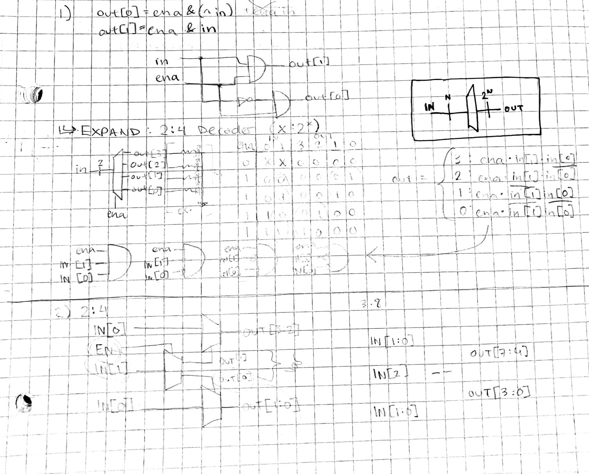
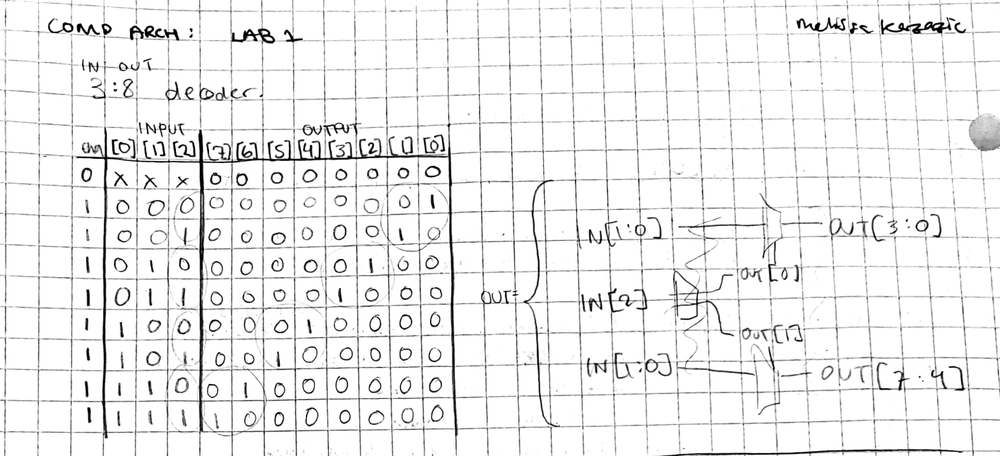
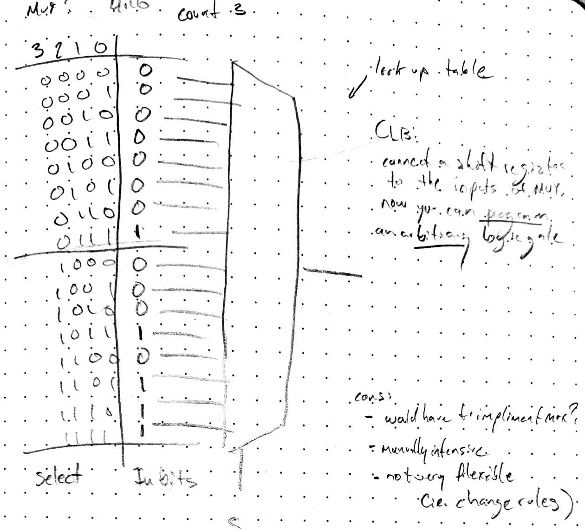
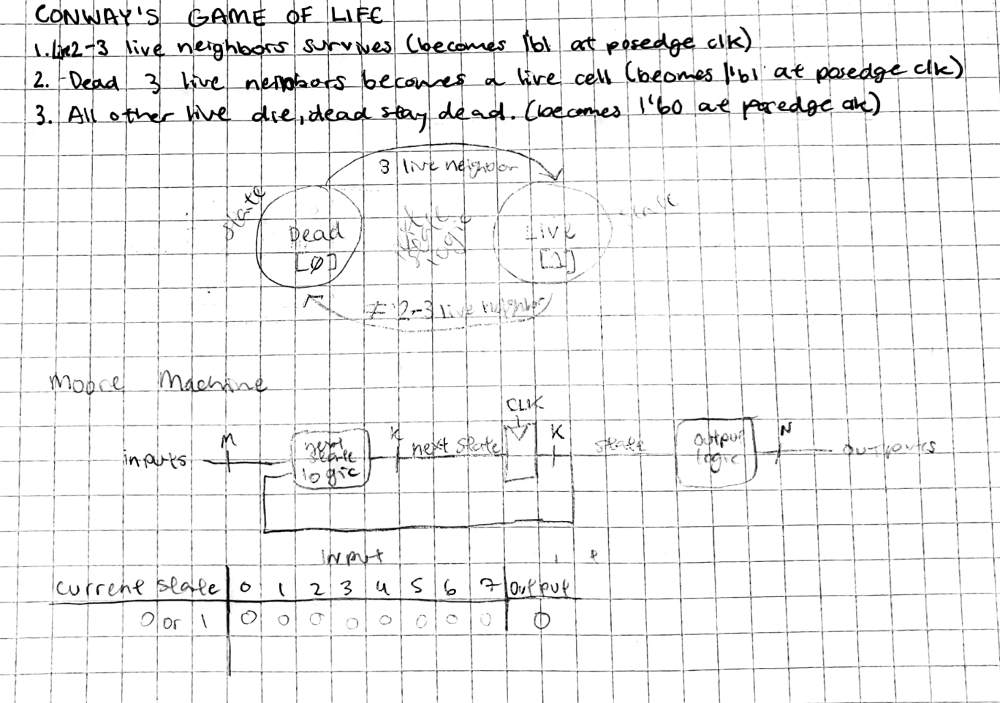
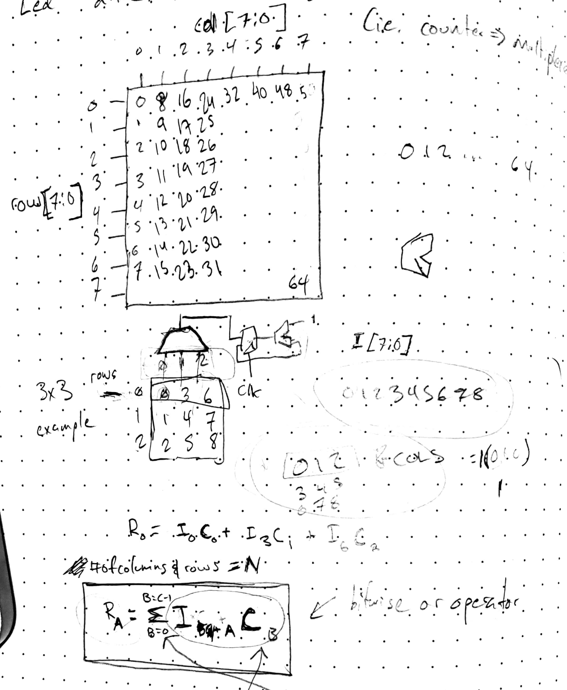
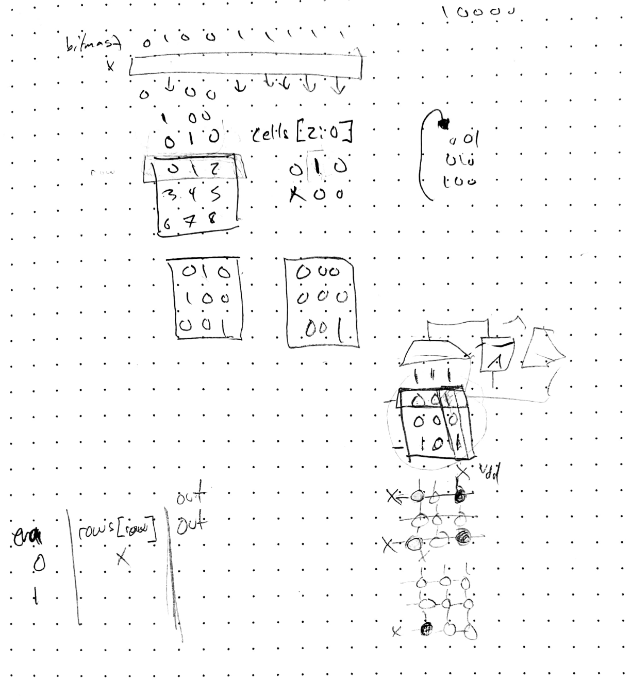

# Lab 0x01: Conway's Game of Life
Elvis Wolcott

Lab Partner: Melissa Kazazic

**We completed the collaboratively and utilized pair programming, as a result our notes and code are shared**

---

## 1. Simulation Practice

We implimented the 2:4 decoder using the binary tree method introduced in class, and followed the same format to create a 3:8 decoder. This was complete after one day in class.

We ran into some unexpected Xs while testing our solution, and realized our test bench was re-using outputs for multiple modules which is not allowed.

## 2. Conway's Game of Life - Cell Module

At the end of the first class we began diagramming how we would solve the cell logic.

We come up with the solution of using a MUX to impliment a truth table, but decided it lacked clarity and realized it would require implimenting a MUX as well. At the end of the class period, we had settled on using addition to count living neighbords.

In the next lab day, we developed the logic for our ripple adders and diagramed out the different modules we would need to build our 8-input adder for the neighbors.

We quickly implimented our adders in Verilog and wrote tests so that we could verify them.

Next, we came up with the state transition diagram for our cell state machine and made a logic diagram for it.

We tested this by looking at the waveform. By changing the display format of variables, we were able to set it up to quickly verify the logic was behaving as expected because we knew we could trust our adder module.

## 3. Flashing the FPGA

We did a test flash and ran into a few minor issues. Re-reunning `make program_fpga` resolved a few. The rest were resolved by adding all our `.sv` files as design sources in the Vivado GUI.

## 4. LED Array driver

For our LED driver we went for the 8x8 right away. We inititally wrote the sum of products and attempted to impliment it as nested for loops in a generate statement, but it felt messy and over complicated. We took a step back and tried transposing our LED matrix for a more convient numbering system. This revealed that some simple bitmasking could be used to impliment the logic with the decoded column value. We discovered we could use the unary OR operator as a n-bit OR on the bitmasked values. This resulted in a single for loop going through the rows.

## 5. Build the circuit

We wired up our LED matrix to support the full 8x8 and used 1K ohm resistors for each column. We also updated the pin mappings so that this would be driven by the rows and cols output by our LED driver.

Luckily for us, it worked on the first flash!

We tried a few different initital conditions and checked online for the expected behavior of the configurations.

We noticed that when set to 5x5, because it was fully wired (meaning the unused rows and cols were connected to floating pins), we could see some faint light at different points in the extra cells.

---

Checkout `glider.mp4`!